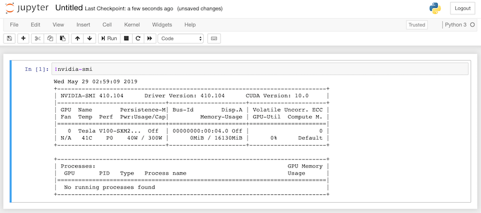

# example: Create a simple Machine Learning environment with Google Compute Engine

## Recommends

- [direnv](https://github.com/direnv/direnv)
- [tfenv](https://github.com/tfutils/tfenv)

## Before use

Edit the `.envrc` file with `direnv edit .` command.

```
export PROJECT_UUID='YOUR-UNIQUE-STRING'
export GOOGLE_CREDENTIALS="${PWD}/gcp-service-account-key.json"
export CLOUDSDK_CORE_PROJECT="YOUR-GCP-PROJECT-ID"
export TF_VAR_gcp_project_id="${CLOUDSDK_CORE_PROJECT}"
export TF_VAR_current_external_ipaddr="$(curl -Ls ifconfig.io)/32"
```

Create a Cloud Storage bucket for save tfstate.

see https://cloud.google.com/storage/docs/gsutil

```shellsession
$ gsutil mb gs://${PROJECT_UUID}/
Creating gs://YOUR-UNIQUE-STRING/...
$ gsutil acl set private gs://${PROJECT_UUID}/
Setting ACL on gs://YOUR-UNIQUE-STRING/...
$ gsutil versioning set on gs://${PROJECT_UUID}/
Enabling versioning for gs://YOUR-UNIQUE-STRING/...
```

```shellsession
$ gsutil ls -Lb gs://${PROJECT_UUID}/
gs://YOUR-UNIQUE-STRING/ :
        Storage class:                  STANDARD
        Location constraint:            US
        Versioning enabled:             True
(omitted)
        Bucket Policy Only enabled:     False
        ACL:
          [
            {
              "entity": "project-owners-012345678901",
              "projectTeam": {
                "projectNumber": "012345678901",
                "team": "owners"
              },
              "role": "OWNER"
            }
          ]
        Default ACL:
(omitted)
```

## How to use

1. Install Terraform via tfenv.

```shellsession
$ tfenv install min-required
```

or

```shellsession
$ tfenv use min-required
```

2. `terraform init`

```shellsession
$ terraform init -backend-config="bucket=${PROJECT_UUID}"
```

3. `terraform apply`

```shellsession
$ terraform apply
```

After running the `terraform apply` command, probably you should reset the GCE instance.

```shellsession
$ gcloud compute instances reset $GCE_INSTANCE_NAME
```

4. Login via SSH

```shellsession
$ ssh -l $YOUR_NAME $IPADDR hostname
gpu-instance-1
```

### Additional samples

Install the Nvidia driver.

```shellsession
$ ssh $IPADDR -l $YOUR_NAME
======================================
Welcome to the Google Deep Learning VM
======================================

Version: common-cu100.m26
Based on: Debian GNU/Linux 9.9 (stretch) (GNU/Linux 4.9.0-9-amd64 x86_64\n)

Resources:
 * Google Deep Learning Platform StackOverflow: https://stackoverflow.com/questions/tagged/google-dl-platform
 * Google Cloud Documentation: https://cloud.google.com/deep-learning-vm
 * Google Group: https://groups.google.com/forum/#!forum/google-dl-platform

To reinstall Nvidia driver (if needed) run:
sudo /opt/deeplearning/install-driver.sh
Linux gpu-instance-1 4.9.0-9-amd64 #1 SMP Debian 4.9.168-1+deb9u2 (2019-05-13) x86_64

The programs included with the Debian GNU/Linux system are free software;
the exact distribution terms for each program are described in the
individual files in /usr/share/doc/*/copyright.

Debian GNU/Linux comes with ABSOLUTELY NO WARRANTY, to the extent
permitted by applicable law.

This VM requires Nvidia drivers to function correctly.   Installation takes ~1 minute.
Would you like to install the Nvidia driver? [y/n] y
Installing Nvidia driver.
Installing driver from GCS location gs://nvidia-drivers-us-public/tesla/410.104/NVIDIA-Linux-x86_64-410.104.run
Copying gs://nvidia-drivers-us-public/tesla/410.104/NVIDIA-Linux-x86_64-410.104.run...
- [1 files][101.1 MiB/101.1 MiB]
Operation completed over 1 objects/101.1 MiB.
Verifying archive integrity... OK
Uncompressing NVIDIA Accelerated Graphics Driver for Linux-x86_64 410.104.....................................................................................................................................................................................................................................................
.................................................................................................................................................................................................................................................................................................

WARNING: The nvidia-drm module will not be installed. As a result, DRM-KMS will not function with this installation of the NVIDIA driver.


WARNING: nvidia-installer was forced to guess the X library path '/usr/lib' and X module path '/usr/lib/xorg/modules'; these paths were not queryable from the system.  If X fails to find the NVIDIA X driver module, please install the `pkg-config` utility and the X.Org SDK/development package for your distribution
         and reinstall the driver.


WARNING: Unable to find a suitable destination to install 32-bit compatibility libraries. Your system may not be set up for 32-bit compatibility. 32-bit compatibility files will not be installed; if you wish to install them, re-run the installation and set a valid directory with the --compat32-libdir option.

Nvidia driver installed.
```

```shellsession
YOUR_NAME@gpu-instance-1:~$ nvidia-smi
Wed May 29 01:42:41 2019
+-----------------------------------------------------------------------------+
| NVIDIA-SMI 410.104      Driver Version: 410.104      CUDA Version: 10.0     |
|-------------------------------+----------------------+----------------------+
| GPU  Name        Persistence-M| Bus-Id        Disp.A | Volatile Uncorr. ECC |
| Fan  Temp  Perf  Pwr:Usage/Cap|         Memory-Usage | GPU-Util  Compute M. |
|===============================+======================+======================|
|   0  Tesla V100-SXM2...  Off  | 00000000:00:04.0 Off |                    0 |
| N/A   39C    P0    39W / 300W |      0MiB / 16130MiB |      0%      Default |
+-------------------------------+----------------------+----------------------+

+-----------------------------------------------------------------------------+
| Processes:                                                       GPU Memory |
|  GPU       PID   Type   Process name                             Usage      |
|=============================================================================|
|  No running processes found                                                 |
+-----------------------------------------------------------------------------+
```

Send sample files to the instance.

```shellsession
$ tar c sample-files | ssh $IPADDR -l $YOUR_NAME tar x
```

Install Docker Compose.

see https://docs.docker.com/compose/install/

```shellsession
$ ssh $IPADDR -l $YOUR_NAME
YOUR_NAME@gpu-instance-1:~$ sudo curl -L "https://github.com/docker/compose/releases/download/1.24.0/docker-compose-$(uname -s)-$(uname -m)" -o /usr/local/bin/docker-compose
  % Total    % Received % Xferd  Average Speed   Time    Time     Time  Current
                                 Dload  Upload   Total   Spent    Left  Speed
100   617    0   617    0     0   2241      0 --:--:-- --:--:-- --:--:--  2235
100 15.4M  100 15.4M    0     0  16.7M      0 --:--:-- --:--:-- --:--:-- 16.7M
YOUR_NAME@gpu-instance-1:~$ sudo chmod +x /usr/local/bin/docker-compose
```

Use Docker Compose.

```shellsession
YOUR_NAME@gpu-instance-1:~$ cd sample-files/docker-compose-2.3-tensorflow/
YOUR_NAME@gpu-instance-1:~/sample-files/docker-compose-2.3-tensorflow$ docker-compose up
Creating network "docker-compose-23-tensorflow_default" with the default driver
Creating docker-compose-23-tensorflow_tensorflow_1 ... done
Attaching to docker-compose-23-tensorflow_tensorflow_1
tensorflow_1  |
tensorflow_1  | ________                               _______________
tensorflow_1  | ___  __/__________________________________  ____/__  /________      __
tensorflow_1  | __  /  _  _ \_  __ \_  ___/  __ \_  ___/_  /_   __  /_  __ \_ | /| / /
tensorflow_1  | _  /   /  __/  / / /(__  )/ /_/ /  /   _  __/   _  / / /_/ /_ |/ |/ /
tensorflow_1  | /_/    \___//_/ /_//____/ \____//_/    /_/      /_/  \____/____/|__/
tensorflow_1  |
tensorflow_1  |
tensorflow_1  | WARNING: You are running this container as root, which can cause new files in
tensorflow_1  | mounted volumes to be created as the root user on your host machine.
tensorflow_1  |
tensorflow_1  | To avoid this, run the container by specifying your user's userid:
tensorflow_1  |
tensorflow_1  | $ docker run -u $(id -u):$(id -g) args...
tensorflow_1  |
tensorflow_1  | [I 02:06:12.226 NotebookApp] Writing notebook server cookie secret to /root/.local/share/jupyter/runtime/notebook_cookie_secret
tensorflow_1  | [I 02:06:13.377 NotebookApp] Serving notebooks from local directory: /tf
tensorflow_1  | [I 02:06:13.379 NotebookApp] The Jupyter Notebook is running at:
tensorflow_1  | [I 02:06:13.379 NotebookApp] http://(a1f1fa0efd18 or 127.0.0.1):8888/?token=0f6db970261eee356caa9fb149c81ad57e0ab68127d3c486
tensorflow_1  | [I 02:06:13.380 NotebookApp] Use Control-C to stop this server and shut down all kernels (twice to skip confirmation).
tensorflow_1  | [C 02:06:13.386 NotebookApp]
tensorflow_1  |
tensorflow_1  |     To access the notebook, open this file in a browser:
tensorflow_1  |         file:///root/.local/share/jupyter/runtime/nbserver-8-open.html
tensorflow_1  |     Or copy and paste one of these URLs:
tensorflow_1  |         http://(a1f1fa0efd18 or 127.0.0.1):8888/?token=0f6db970261eee356caa9fb149c81ad57e0ab68127d3c486
```


